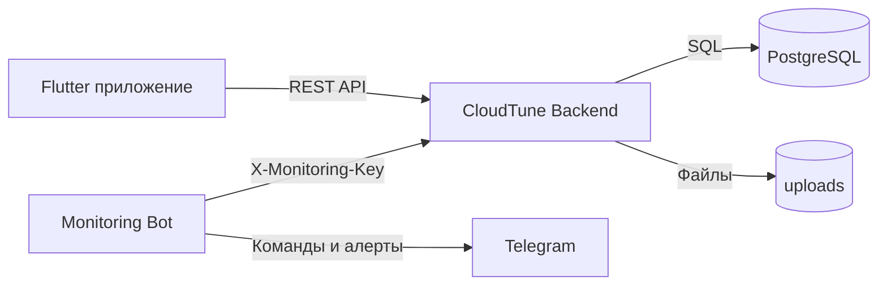

# CloudTune


CloudTune - это музыкальный fullstack-проект с локальной библиотекой, облачным хранилищем, API на Go и отдельным Telegram-ботом для мониторинга.

## Чо умеет система

- регистрация и вход по JWT;
- локальная библиотека с сохранением между запусками (файлы, плейлисты, лайки);
- облачная библиотека и облачные плейлисты;
- дедупликация загрузок на backend по `SHA-256` (`content_hash`);
- системный плейлист `Liked songs` в облаке;
- фоновое воспроизведение через `audio_service` + `just_audio`;
- Windows desktop-shell интерфейс в Flutter-клиенте;
- Telegram-бот мониторинга с кнопочным меню и авто-алертами.

## Модули репозитория

- `backend/` - REST API на Go + PostgreSQL.
- `frontend/cloudtune_flutter_app/` - Flutter-клиент (Android + desktop).
- `monitoring/` - Telegram-бот мониторинга на Python.
- `landing/` - статический лендинг проекта для Nginx.


## Схема системы



## Быстрый запуск

1. Backend:

```bash
cd backend
docker compose --env-file .env.prod -f docker-compose.prod.yml up -d --build
```

2. Flutter-клиент:

```bash
cd frontend/cloudtune_flutter_app
flutter pub get
flutter run --dart-define=API_BASE_URL=https://api.your-domain.com
```

3. Monitoring-бот:

```bash
cd monitoring
python -m venv .venv
.venv\Scripts\activate
pip install -r requirements.txt
python src/bot.py
```

## Где смотреть детали

- `backend/README.md`
- `frontend/README.md`
- `frontend/cloudtune_flutter_app/README.md`
- `monitoring/README.md`

## Коротко по текущему состоянию

- API и БД запускаются в Docker, backend работает за Nginx.
- Monitoring-бот работает отдельно и использует `MONITORING_API_KEY`.
- Клиент поддерживает локальное/облачное хранилище, плейлисты и фоновой плеер.
