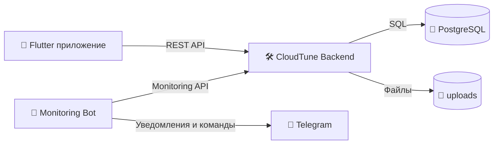

# 🎵 CloudTune


CloudTune — fullstack-сервис для музыки с локальной библиотекой, облачным хранением и Telegram-мониторингом сервера.

## ✨ Что есть в проекте

- 🔐 Авторизация пользователей (`register/login`, JWT)
- ☁️ Загрузка и скачивание треков из облака
- 📚 Локальная библиотека с сохранением между запусками
- 🗂️ Локальные и облачные плейлисты
- 🎧 Фоновый плеер (`audio_service` + `just_audio`)
- 🤖 Telegram-бот мониторинга backend

## 🧩 Модули репозитория

- `backend/` — API на Go + PostgreSQL
- `frontend/cloudtune_flutter_app/` — мобильный клиент на Flutter
- `monitoring/` — Python Telegram-бот для мониторинга

## 🗺️ Схема системы



## 🚀 Быстрый старт

1. Запуск backend:

```bash
cd backend
docker compose --env-file .env.prod -f docker-compose.prod.yml up -d --build
```

2. Запуск Flutter приложения:

```bash
cd frontend/cloudtune_flutter_app
flutter pub get
flutter run --dart-define=API_BASE_URL=https://api.your-domain.com
```

3. Запуск monitoring-бота:

```bash
cd monitoring
python -m venv .venv
.venv\Scripts\activate
pip install -r requirements.txt
python src/bot.py
```

## 📘 Документация по папкам

- `backend/README.md`
- `frontend/README.md`
- `frontend/cloudtune_flutter_app/README.md`
- `monitoring/README.md`

## 🧪 Текущее состояние

Проект уже можно использовать как MVP: backend и мониторинг развёрнуты в Docker, приложение устанавливается как APK и поддерживает обновление при подписи тем же keystore.
