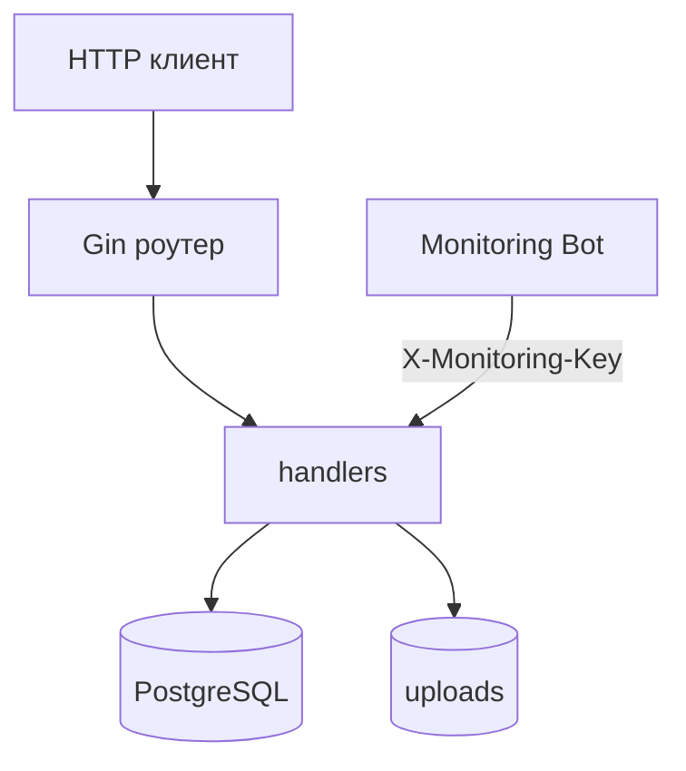

# CloudTune Backend


Backend-часть CloudTune: REST API для авторизации, облачной библиотеки, плейлистов и мониторинга.

## Что реализовано

- JWT-аутентификация (`/auth/register`, `/auth/login`);
- загрузка треков с проверкой MIME и дедупликацией по `content_hash`;
- персональная библиотека пользователя через `user_library`;
- удаление трека с корректной очисткой связей из плейлистов;
- системный облачный плейлист избранного (`is_favorite`);
- расчет использования облачного хранилища и квоты;
- Monitoring API с ключом `X-Monitoring-Key`.

## Архитектура



## Структура

```text
backend/
  cmd/api/main.go
  internal/database/
  internal/handlers/
  internal/middleware/
  internal/models/
  internal/monitoring/
  internal/utils/
  docker-compose.yml
  docker-compose.prod.yml
```

## Локальный запуск

```bash
cd backend
docker compose up --build
```

API по умолчанию: `http://localhost:8080`.

## Production запуск

1. Подготовить переменные:

```bash
cd backend
cp .env.prod.example .env.prod
```

2. Запустить:

```bash
docker compose --env-file .env.prod -f docker-compose.prod.yml up -d --build
```

3. При схеме с Nginx backend обычно слушает `127.0.0.1:8080`.

## Deploy Script (GitHub + rollback)

Скрипт: `backend/scripts/deploy-from-github.sh`.

Что делает:
- обновляет код из GitHub;
- деплоит backend через `docker compose`;
- обновляет основной и resume-лендинг;
- запускает post-deploy автотесты (`backend/scripts/run_post_deploy_tests.py`);
- при падении тестов откатывает на предыдущий commit и деплоит его обратно;
- перезапускает `cloudtune-monitoring-bot` с задержкой.

## Переменные окружения

- `DB_HOST` - хост БД (`localhost` по умолчанию).
- `DB_PORT` - порт БД (`5432` по умолчанию).
- `DB_USER` - пользователь PostgreSQL.
- `DB_PASSWORD` - пароль PostgreSQL.
- `DB_NAME` - имя БД.
- `JWT_SECRET` - секрет подписи JWT.
- `MONITORING_API_KEY` - ключ доступа к Monitoring API.
- `CLOUD_UPLOADS_PATH` - папка хранения файлов (`./uploads` по умолчанию).
- `CLOUD_STORAGE_QUOTA_BYTES` - квота облака в байтах (по умолчанию `3221225472`, это 3 ГБ).

## Monitoring API

Все эндпоинты требуют заголовок `X-Monitoring-Key: <MONITORING_API_KEY>`.

- `GET /api/monitor/status`
- `GET /api/monitor/storage`
- `GET /api/monitor/connections`
- `GET /api/monitor/users`
- `GET /api/monitor/users/list?page=1&limit=8`
- `DELETE /api/monitor/users/delete?email=user@example.com`
- `GET /api/monitor/all`

## Основные API эндпоинты

Публичные:

- `GET /health`
- `GET /api/status`
- `POST /auth/register`
- `POST /auth/login`

Защищенные (`Authorization: Bearer <token>`):

- `POST /api/songs/upload`
- `GET /api/songs/library`
- `GET /api/songs/:id`
- `DELETE /api/songs/:id`
- `GET /api/songs/download/:id`
- `GET /api/storage/usage`
- `DELETE /api/profile`
- `POST /api/playlists`
- `GET /api/playlists`
- `DELETE /api/playlists/:playlist_id`
- `POST /api/playlists/:playlist_id/songs/:song_id`
- `GET /api/playlists/:playlist_id/songs`

## Примечания

- Схема БД создается автоматически при старте.
- Допустимые MIME-типы для загрузки: `audio/mpeg`, `audio/wav`, `audio/mp4`, `audio/flac`.
- В Dockerfile для сборки используется образ `golang:1.25`, при этом `go.mod` зафиксирован на `go 1.24.0`.

## Pagination and Search

The following endpoints now support server-side `limit`, `offset`, and `search` query params:

- `GET /api/songs/library`
- `GET /api/playlists`
- `GET /api/playlists/:playlist_id/songs`

Each response includes:

- `count` (items in current page)
- `total` (total matching rows)
- `limit`
- `offset`
- `has_more`
- `next_offset`
- `search`

This prevents oversized responses for large libraries and enables lazy loading on clients.

## Quotas and Limits

Storage/upload behavior is controlled by env vars:

- `CLOUD_STORAGE_QUOTA_BYTES` (default `3221225472`, 3 GB per user)
- `CLOUD_MAX_UPLOAD_SIZE_BYTES` (default `104857600`, 100 MB per file)
- `CLOUD_MAX_PARALLEL_UPLOADS` (default `4`)
- `CLOUD_UPLOADS_PATH` (default `./uploads`)

## Observability Notes

- Every request now has `X-Request-ID`; the backend logs include `request_id=...` for correlation.
- Monitoring snapshot now includes upload failure reasons and upload status-class counters (`2xx/4xx/5xx`) with rates.
- Monitoring bot supports threshold alerts for upload `4xx`/`5xx` spikes.

## Release Process and Rollback

- Release checklist: `backend/docs/release-checklist.md`
- Deploy script: `backend/scripts/deploy-from-github.sh`
- Post-deploy smoke tests: `backend/scripts/run_post_deploy_tests.py`

Rollback criteria are codified in deploy flow:

- If post-deploy smoke tests fail and `ROLLBACK_ON_TEST_FAILURE=true`, deploy rolls back to previous commit.
- Rollback re-runs backend + landing deployment and restarts monitoring bot.

## Root Access Policy

For safer ops, deploy script blocks root execution by default.

- `ALLOW_DEPLOY_AS_ROOT=false` (default): deployment as root is rejected.
- Set `ALLOW_DEPLOY_AS_ROOT=true` only for controlled emergency scenarios.

## Dirty Worktree Handling

Deploy can auto-protect local server edits before updating from GitHub.

- `DEPLOY_AUTOSTASH_LOCAL_CHANGES=true` (default): if the repo has local changes, deploy runs `git stash --include-untracked` and then continues with `pull --ff-only`.
- `DEPLOY_AUTOSTASH_LOCAL_CHANGES=false`: deploy fails fast and prints changed files, requiring manual cleanup.
