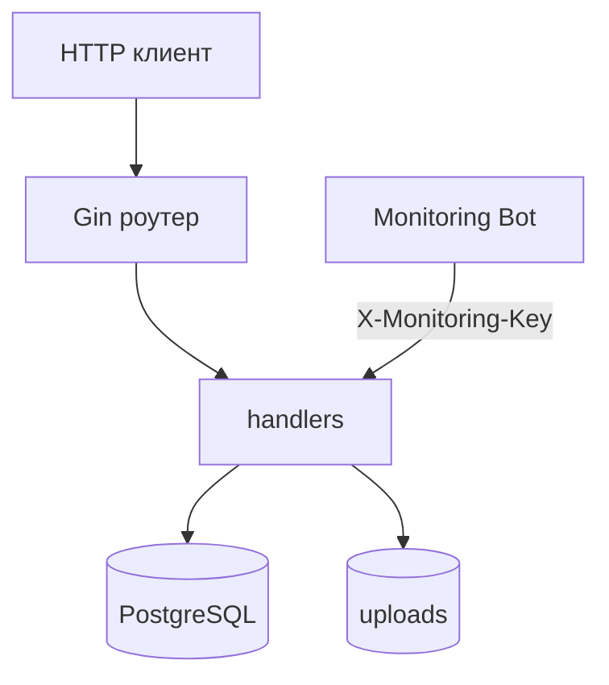

# CloudTune Backend


Backend-часть CloudTune: REST API для авторизации, облачной библиотеки, плейлистов и мониторинга.

## Что реализовано

- JWT-аутентификация (`/auth/register`, `/auth/login`);
- загрузка треков с проверкой MIME и дедупликацией по `content_hash`;
- персональная библиотека пользователя через `user_library`;
- удаление трека с корректной очисткой связей из плейлистов;
- системный облачный плейлист избранного (`is_favorite`);
- расчет использования облачного хранилища и квоты;
- Monitoring API с ключом `X-Monitoring-Key`.

## Архитектура



## Структура

```text
backend/
  cmd/api/main.go
  internal/database/
  internal/handlers/
  internal/middleware/
  internal/models/
  internal/monitoring/
  internal/utils/
  docker-compose.yml
  docker-compose.prod.yml
```

## Локальный запуск

```bash
cd backend
docker compose up --build
```

API по умолчанию: `http://localhost:8080`.

## Production запуск

1. Подготовить переменные:

```bash
cd backend
cp .env.prod.example .env.prod
```

2. Запустить:

```bash
docker compose --env-file .env.prod -f docker-compose.prod.yml up -d --build
```

3. При схеме с Nginx backend обычно слушает `127.0.0.1:8080`.

## Переменные окружения

- `DB_HOST` - хост БД (`localhost` по умолчанию).
- `DB_PORT` - порт БД (`5432` по умолчанию).
- `DB_USER` - пользователь PostgreSQL.
- `DB_PASSWORD` - пароль PostgreSQL.
- `DB_NAME` - имя БД.
- `JWT_SECRET` - секрет подписи JWT.
- `MONITORING_API_KEY` - ключ доступа к Monitoring API.
- `CLOUD_UPLOADS_PATH` - папка хранения файлов (`./uploads` по умолчанию).
- `CLOUD_STORAGE_QUOTA_BYTES` - квота облака в байтах (по умолчанию `3221225472`, это 3 ГБ).

## Monitoring API

Все эндпоинты требуют заголовок `X-Monitoring-Key: <MONITORING_API_KEY>`.

- `GET /api/monitor/status`
- `GET /api/monitor/storage`
- `GET /api/monitor/connections`
- `GET /api/monitor/users`
- `GET /api/monitor/users/list?page=1&limit=8`
- `GET /api/monitor/all`

## Основные API эндпоинты

Публичные:

- `GET /health`
- `GET /api/status`
- `POST /auth/register`
- `POST /auth/login`

Защищенные (`Authorization: Bearer <token>`):

- `POST /api/songs/upload`
- `GET /api/songs/library`
- `GET /api/songs/:id`
- `DELETE /api/songs/:id`
- `GET /api/songs/download/:id`
- `GET /api/storage/usage`
- `POST /api/playlists`
- `GET /api/playlists`
- `DELETE /api/playlists/:playlist_id`
- `POST /api/playlists/:playlist_id/songs/:song_id`
- `GET /api/playlists/:playlist_id/songs`

## Примечания

- Схема БД создается автоматически при старте.
- Допустимые MIME-типы для загрузки: `audio/mpeg`, `audio/wav`, `audio/mp4`, `audio/flac`.
- В Dockerfile для сборки используется образ `golang:1.25`, при этом `go.mod` зафиксирован на `go 1.24.0`.
