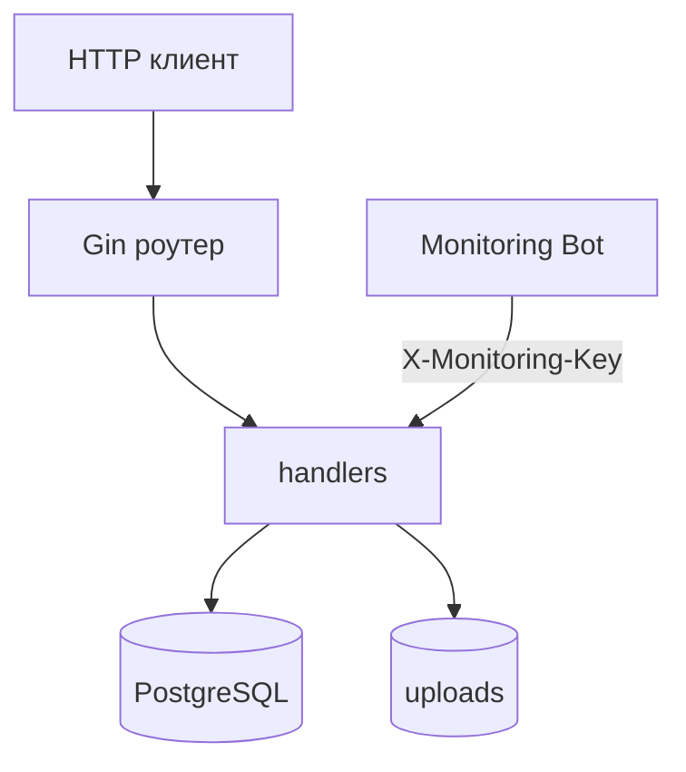

# 🛠️ CloudTune Backend


Backend-часть CloudTune: API для авторизации, треков, плейлистов и мониторинга.

## ✨ Возможности

- 🔐 Регистрация и вход пользователей (JWT)
- 🎵 Загрузка треков в облако
- 📚 Персональная библиотека пользователя
- 🗂️ Плейлисты (создание, чтение, удаление, добавление треков)
- ⬇️ Скачивание треков с проверкой доступа
- 📈 Monitoring API для Telegram-бота

## 🏗️ Архитектура



## 📁 Структура

```text
backend/
  cmd/api/main.go
  internal/database/
  internal/handlers/
  internal/middleware/
  internal/models/
  internal/monitoring/
  internal/utils/
  docker-compose.yml
  docker-compose.prod.yml
```

## ⚙️ Запуск (локально)

```bash
cd backend
docker compose up --build
```

API по умолчанию: `http://localhost:8080`

## 🚀 Production запуск

1. Подготовить переменные:

```bash
cd backend
cp .env.prod.example .env.prod
```

2. Запустить:

```bash
docker compose --env-file .env.prod -f docker-compose.prod.yml up -d --build
```

3. При работе через Nginx API слушает: `127.0.0.1:8080`

## 🌍 Переменные окружения

- `DB_HOST` — хост БД (по умолчанию `localhost`)
- `DB_PORT` — порт БД (по умолчанию `5432`)
- `DB_USER` — пользователь БД
- `DB_PASSWORD` — пароль БД
- `DB_NAME` — имя БД
- `JWT_SECRET` — секрет JWT
- `MONITORING_API_KEY` — ключ для Monitoring API
- `CLOUD_UPLOADS_PATH` — путь к папке файлов (`./uploads`)
- `CLOUD_STORAGE_QUOTA_BYTES` — квота облака в байтах (по умолчанию 3 ГБ)

## 📡 Monitoring API

Все ручки требуют заголовок: `X-Monitoring-Key: <MONITORING_API_KEY>`

- `GET /api/monitor/status`
- `GET /api/monitor/storage`
- `GET /api/monitor/connections`
- `GET /api/monitor/users`
- `GET /api/monitor/users/list?page=1&limit=8`
- `GET /api/monitor/all`

## 🔌 Основные API ручки

Публичные:

- `GET /health`
- `GET /api/status`
- `POST /auth/register`
- `POST /auth/login`

Защищённые (`Authorization: Bearer <token>`):

- `POST /api/songs/upload`
- `GET /api/songs/library`
- `GET /api/songs/:id`
- `DELETE /api/songs/:id`
- `GET /api/songs/download/:id`
- `GET /api/storage/usage`
- `POST /api/playlists`
- `GET /api/playlists`
- `DELETE /api/playlists/:playlist_id`
- `POST /api/playlists/:playlist_id/songs/:song_id`
- `GET /api/playlists/:playlist_id/songs`

## 📝 Примечания

- Таблицы БД создаются автоматически при старте.
- Допустимые MIME-типы загрузки: `audio/mpeg`, `audio/wav`, `audio/mp4`, `audio/flac`.
- Мониторинг-бот вынесен в отдельный сервис: `../monitoring`.
