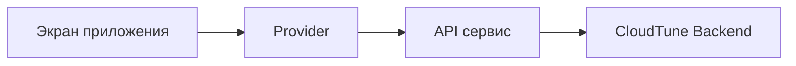

# 📱 CloudTune Frontend


Папка `frontend/` содержит клиентское приложение CloudTune на Flutter.

## 📦 Где находится код

- Основной проект: `frontend/cloudtune_flutter_app/`
- Точка входа: `frontend/cloudtune_flutter_app/lib/main.dart`

## ✨ Что умеет клиент

- 🔐 Вход и регистрация через backend
- 🎵 Локальная библиотека треков
- ❤️ Лайки + системный плейлист `Liked songs`
- ☁️ Облачная библиотека и облачные плейлисты
- ⬆️/⬇️ Загрузка и скачивание треков
- 🎧 Фоновое воспроизведение

## 🚀 Запуск

```bash
cd frontend/cloudtune_flutter_app
flutter pub get
flutter run
```

## 🔗 Настройка API

По умолчанию клиент использует `https://api-mp3-player.ru`.

Для своего сервера:

```bash
flutter run --dart-define=API_BASE_URL=https://api.your-domain.com
```

Для релизной сборки:

```bash
flutter build apk --release --dart-define=API_BASE_URL=https://api.your-domain.com
```

## 🧭 Схема взаимодействия



## 📘 Подробная документация

Полное описание клиента и структуры слоёв: `frontend/cloudtune_flutter_app/README.md`.
