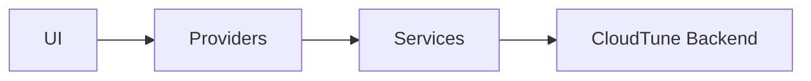

# CloudTune Frontend


Папка `frontend/` содержит клиентскую часть CloudTune.

## Где находится основной код

- Flutter-приложение: `frontend/cloudtune_flutter_app/`
- Точка входа: `frontend/cloudtune_flutter_app/lib/main.dart`

## Что умеет клиент

- вход и регистрация через backend;
- локальная библиотека с хранением в `SharedPreferences`;
- локальные плейлисты и системный список избранного;
- облачная библиотека и синхронизация плейлистов;
- загрузка/скачивание треков;
- фоновый плеер с `audio_service` + `just_audio`;
- переключение языка (`ru`, `en`, `es`) и темы;
- отдельная desktop-раскладка для Windows.

## Запуск

```bash
cd frontend/cloudtune_flutter_app
flutter pub get
flutter run
```

## Настройка API

По умолчанию используется `https://api-mp3-player.ru`.

Если нужен свой сервер:

```bash
flutter run --dart-define=API_BASE_URL=https://api.your-domain.com
```

Для release-сборки APK:

```bash
flutter build apk --release --dart-define=API_BASE_URL=https://api.your-domain.com
```

Важно для single-backend режима:
- в release используется только `API_BASE_URL`;
- fallback-хосты отключены в release принудительно;
- fallback можно включать только для debug-диагностики:

```bash
flutter run --dart-define=API_BASE_URL=https://api.your-domain.com --dart-define=API_ENABLE_FALLBACK_URLS=true
```

Проверить активный backend-host можно на debug-экране `API Tester` в приложении.

## Схема взаимодействия



## Подробная документация

Полное описание архитектуры клиента, экранов и сервисов находится в `frontend/cloudtune_flutter_app/README.md`.
