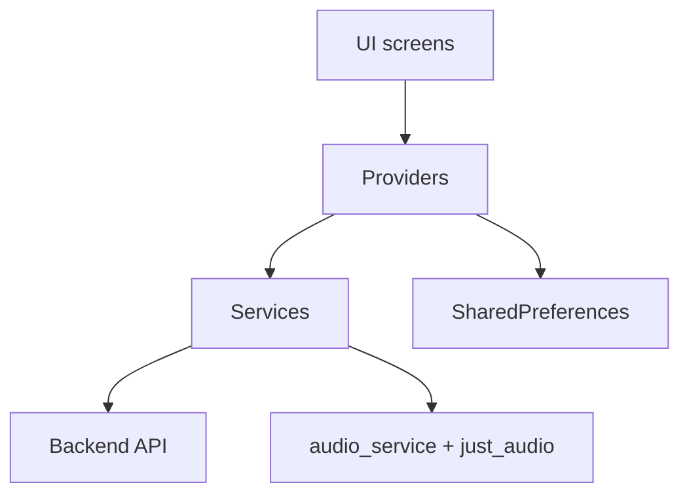

# CloudTune Flutter App


Flutter-клиент CloudTune для локального и облачного прослушивания.

## Актуальный функционал

- аутентификация (`register/login`) и хранение токена;
- локальные треки, локальные плейлисты, лайки, восстановление состояния после перезапуска;
- облачная библиотека, облачные плейлисты, загрузка и скачивание треков;
- синхронизация локальных плейлистов в облако;
- плеер с очередью, seek, next/prev, shuffle, repeat-one;
- фоновое воспроизведение и media notification;
- переключение темы и акцентной палитры;
- локализация интерфейса: русский, английский, испанский;
- desktop-shell для Windows с отдельной компоновкой.

## Архитектура приложения



## Структура `lib/`

```text
lib/
  main.dart
  models/
  providers/
  screens/
  services/
  theme/
  utils/
  widgets/
```

## Ключевые файлы

- `lib/main.dart` - инициализация `AudioService`, провайдеров и роутинга.
- `lib/providers/local_music_provider.dart` - локальная библиотека, плейлисты, лайки.
- `lib/providers/audio_player_provider.dart` - состояние и логика плеера.
- `lib/providers/cloud_music_provider.dart` - работа с облачной библиотекой.
- `lib/services/audio_handler.dart` - фоновый аудио-движок.
- `lib/services/api_service.dart` - API-запросы и fallback по базовым URL.
- `lib/screens/home_screen.dart` - экран плеера.
- `lib/screens/server_music_screen.dart` - экран хранилища (local/cloud).
- `lib/screens/windows_desktop_shell.dart` - desktop UI для Windows.

## Запуск

```bash
cd frontend/cloudtune_flutter_app
flutter pub get
flutter run
```

## Настройка backend URL

Для запуска на своем API:

```bash
flutter run --dart-define=API_BASE_URL=https://api.your-domain.com
```

Для release APK:

```bash
flutter build apk --release --dart-define=API_BASE_URL=https://api.your-domain.com
```

## Платформенные заметки

- Android минимум: **API 21 (Android 5.0)**.
- Для desktop-аудио используется `just_audio_media_kit`.
- На Windows при ширине >= 920px автоматически включается desktop-shell.

## Проверка качества

```bash
flutter analyze
```

```bash
flutter test
```

## Важно знать

- Локальные данные хранятся через `SharedPreferences`.
- Базовый API берется из `API_BASE_URL`, при сетевых ошибках используются fallback-адреса из `lib/utils/constants.dart`.
- Для обновления APK поверх установленного приложения используйте тот же keystore.
