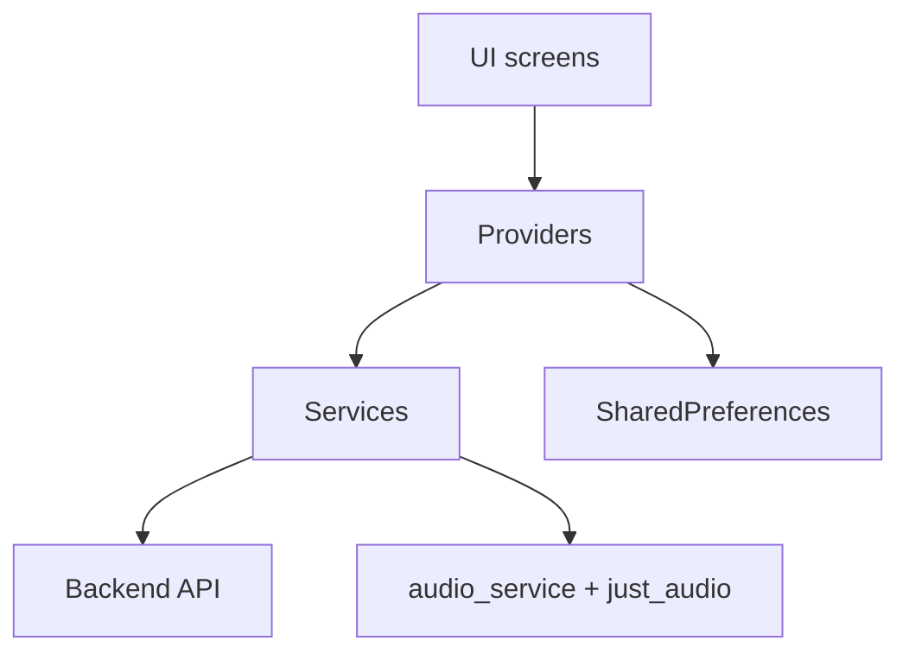

# 🎧 CloudTune Flutter App


Flutter-клиент CloudTune для локального и облачного прослушивания музыки.

## ✨ Функциональность

- 🔐 Аутентификация: вход и регистрация
- 📁 Локальная библиотека: добавление файлов, поиск, удаление
- 🗂️ Локальные плейлисты: создание, редактирование, удаление
- ❤️ Лайки треков и системный плейлист `Liked songs`
- ☁️ Облако: загрузка, скачивание, синхронизация плейлистов
- 🎚️ Плеер: play/pause/seek, next/prev, shuffle, repeat-one
- 🔔 Фоновое воспроизведение и Android media notification

## 🏗️ Архитектура приложения



## 📁 Структура `lib/`

```text
lib/
  main.dart
  models/
  providers/
  screens/
  services/
  theme/
  utils/
  widgets/
```

## 🔑 Ключевые файлы

- `lib/main.dart` — инициализация приложения и DI providers
- `lib/providers/local_music_provider.dart` — локальная библиотека, плейлисты, лайки
- `lib/providers/audio_player_provider.dart` — синхронизация состояния плеера
- `lib/services/audio_handler.dart` — фоновый аудио-движок
- `lib/services/api_service.dart` — запросы к backend
- `lib/screens/home_screen.dart` — экран плеера
- `lib/screens/server_music_screen.dart` — локальное/облачное хранилище

## ⚙️ Запуск

```bash
cd frontend/cloudtune_flutter_app
flutter pub get
flutter run
```

## 🌐 Настройка backend URL

Используйте `--dart-define`:

```bash
flutter run --dart-define=API_BASE_URL=https://api.your-domain.com
```

Release-сборка:

```bash
flutter build apk --release --dart-define=API_BASE_URL=https://api.your-domain.com
```

## 📱 Android требования

- Минимальная версия Android: **5.0 (API 21)**
- Для стабильного фонового аудио рекомендуется Android 8+

## 🧪 Проверка качества

```bash
flutter analyze
```

```bash
flutter test
```

## 📝 Примечания

- Локальные данные (файлы/плейлисты/лайки) сохраняются через `SharedPreferences`.
- Для корректного обновления APK используйте один и тот же keystore при подписи.
