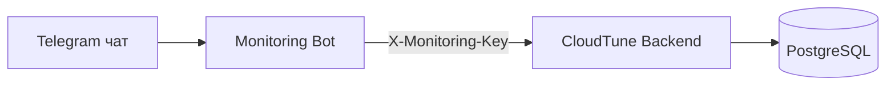

# 🤖 CloudTune Monitoring Bot


Отдельный Telegram-бот для мониторинга CloudTune backend через Monitoring API.

## ✨ Что умеет бот

- 📊 Команды мониторинга: `/status`, `/storage`, `/connections`, `/users`, `/all`, `/help`
- 👥 Пагинация пользователей в `/users` (почта, ник, размер, дата регистрации)
- ◀️▶️ Inline-кнопки для листания страниц пользователей
- 🎨 Красивые ответы с форматированием и эмодзи
- ⏱️ Фоновая проверка backend каждые 5 минут
- 🚨 Авто-уведомления при падении и восстановлении backend

## 🗺️ Схема работы



## 🔐 Переменные окружения

- `TELEGRAM_BOT_TOKEN` — токен бота
- `TELEGRAM_ALLOWED_CHAT_IDS` — список разрешённых chat id через запятую
- `ALERT_RECIPIENT_CHAT_IDS` — список chat id для авто-алертов
- `BACKEND_BASE_URL` — URL backend, например `https://api-mp3-player.ru`
- `BACKEND_MONITORING_API_KEY` — ключ из backend (`MONITORING_API_KEY`)
- `BACKEND_HEALTH_PATH` — путь health-check (обычно `/health`)
- `REQUEST_TIMEOUT` — таймаут HTTP-запроса (сек)
- `ALERTS_ENABLED` — включить/выключить watchdog (`true/false`)
- `ALERT_NOTIFY_ON_START` — слать уведомление при старте (`true/false`)
- `ALERT_CHECK_INTERVAL_SECONDS` — интервал проверки (по умолчанию `300`)
- `USERS_PAGE_SIZE` — размер страницы пользователей (по умолчанию `8`)

## 🚀 Локальный запуск

```bash
cd monitoring
python -m venv .venv
.venv\Scripts\activate
pip install -r requirements.txt
copy .env.example .env
python src/bot.py
```

## 🐳 Запуск через Docker

```bash
cd monitoring
docker compose up --build -d
```

## 🧪 Быстрая проверка

1. Написать боту `/start`
2. Выполнить `/status`
3. Выполнить `/users` и проверить стрелки страниц
4. Остановить backend и дождаться авто-алерта
