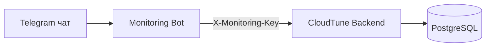

# CloudTune Monitoring Bot


Telegram-бот для мониторинга CloudTune backend через защищенные Monitoring API-эндпоинты.

## Что делает бот

- команды `/status`, `/storage`, `/connections`, `/users`, `/all`, `/help`;
- кнопочное меню в Telegram (ReplyKeyboard);
- пагинация списка пользователей через inline-кнопки;
- форматированные отчеты (HTML parse mode);
- watchdog-проверка backend по `/health` с интервалом;
- авто-уведомления о падении и восстановлении backend.

## Схема работы



## Переменные окружения

- `TELEGRAM_BOT_TOKEN` - токен бота.
- `TELEGRAM_ALLOWED_CHAT_IDS` - белый список chat id через запятую.
- `ALERT_RECIPIENT_CHAT_IDS` - chat id для авто-алертов.
- `BACKEND_BASE_URL` - базовый URL backend.
- `BACKEND_MONITORING_API_KEY` - ключ мониторинга (должен совпадать с backend).
- `BACKEND_HEALTH_PATH` - путь health-check (обычно `/health`).
- `REQUEST_TIMEOUT` - таймаут HTTP-запросов в секундах.
- `ALERTS_ENABLED` - включить/выключить watchdog (`true/false`).
- `ALERT_NOTIFY_ON_START` - слать стартовое уведомление (`true/false`).
- `ALERT_CHECK_INTERVAL_SECONDS` - интервал watchdog (по умолчанию `300`).
- `USERS_PAGE_SIZE` - размер страницы `/users` (по умолчанию `8`).

## Локальный запуск

```bash
cd monitoring
python -m venv .venv
.venv\Scripts\activate
pip install -r requirements.txt
copy .env.example .env
python src/bot.py
```

## Запуск через Docker

```bash
cd monitoring
docker compose up --build -d
```

## Быстрый smoke-check

1. Написать боту `/start`.
2. Запустить `/status`.
3. Проверить `/users` и переключение страниц.
4. Остановить backend и убедиться, что пришел алерт.
